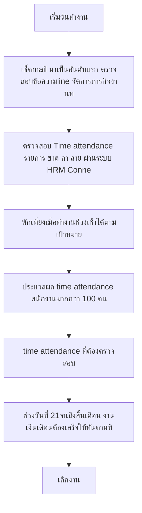

# Workflow Diagram: นาราภัทร

```mermaid
flowchart TD
    S["เริ่มวันทำงาน"]
    M1["เช็คmail มาเป็นอันดับแรก ตรวจสอบข้อความline จัดการภารกิจงานท"]
    M2["ตรวจสอบ Time attendance รายการ ขาด ลา สาย ผ่านระบบ HRM Conne"]
    N["พักเที่ยงเมื่อทำงานช่วงเช้าได้ตามเป้าหมาย"]
    A1["ประมวลผล time attendance พนักงานมากกว่า 100 คน"]
    A2["time attendance ที่ต้องตรวจสอบ"]
    E["ช่วงวันที่ 21จนถึงสิ้นเดือน งานเงินเดือนต้องเสร็จให้ทันตามที"]
    END["เลิกงาน"]
    S --> M1
    M1 --> M2
    M2 --> N
    N --> A1
    A1 --> A2
    A2 --> E
    E --> END
```

> Paste ไฟล์นี้ที่ [mermaid.live](https://mermaid.live) เพื่อ render เป็นแผนภาพ
