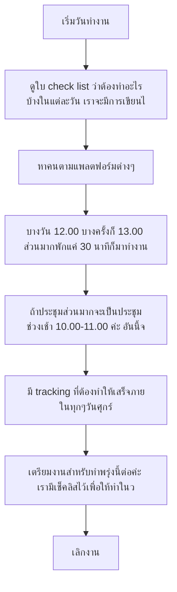

# Workflow Diagram: มินท์ธิตา สุภานนท์ธนาสิริ

```mermaid
flowchart TD
    S["เริ่มวันทำงาน"]
    M1["ดูใบ check list ว่าต้องทำอะไรบ้างในแต่ละวัน เราจะมีการเขียนไ"]
    M2["หาคนตามแพลตฟอร์มต่างๆ"]
    N["บางวัน 12.00 บางครั้งก็ 13.00 ส่วนมากพักแค่ 30 นาทีก็มาทำงาน"]
    A1["ถ้าประชุมส่วนมากจะเป็นประชุมช่วงเช้า 10.00-11.00 ค่ะ อันนี้จ"]
    A2["มี tracking ที่ต้องทำให้เสร็จภายในทุกๆวันศุกร์"]
    E["เตรียมงานสำหรับทำพรุ่งนี้ต่อค่ะ เรามีเช็คลิสไว้เพื่อให้ทำในว"]
    END["เลิกงาน"]
    S --> M1
    M1 --> M2
    M2 --> N
    N --> A1
    A1 --> A2
    A2 --> E
    E --> END
```

> Paste ไฟล์นี้ที่ [mermaid.live](https://mermaid.live) เพื่อ render เป็นแผนภาพ
