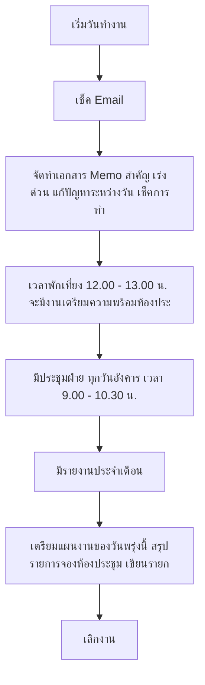

# Workflow Diagram: Paweena Aiemchit

```mermaid
flowchart TD
    S["เริ่มวันทำงาน"]
    M1["เช็ค Email"]
    M2["จัดทำเอกสาร Memo สำคัญ เร่งด่วน แก้ปัญหาระหว่างวัน เช็คการทำ"]
    N["เวลาพักเที่ยง 12.00 - 13.00 น. จะมีงานเตรียมความพร้อมห้องประ"]
    A1["มีประชุมฝ่าย ทุกวันอังคาร เวลา 9.00 - 10.30 น."]
    A2["มีรายงานประจำเดือน"]
    E["เตรียมแผนงานของวันพรุ่งนี้ สรุปรายการจองห้องประชุม เขียนรายก"]
    END["เลิกงาน"]
    S --> M1
    M1 --> M2
    M2 --> N
    N --> A1
    A1 --> A2
    A2 --> E
    E --> END
```

> Paste ไฟล์นี้ที่ [mermaid.live](https://mermaid.live) เพื่อ render เป็นแผนภาพ
